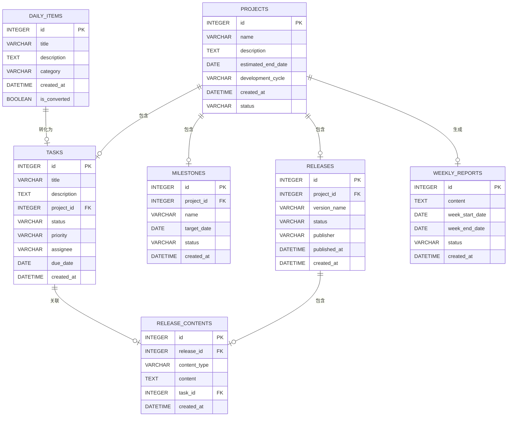
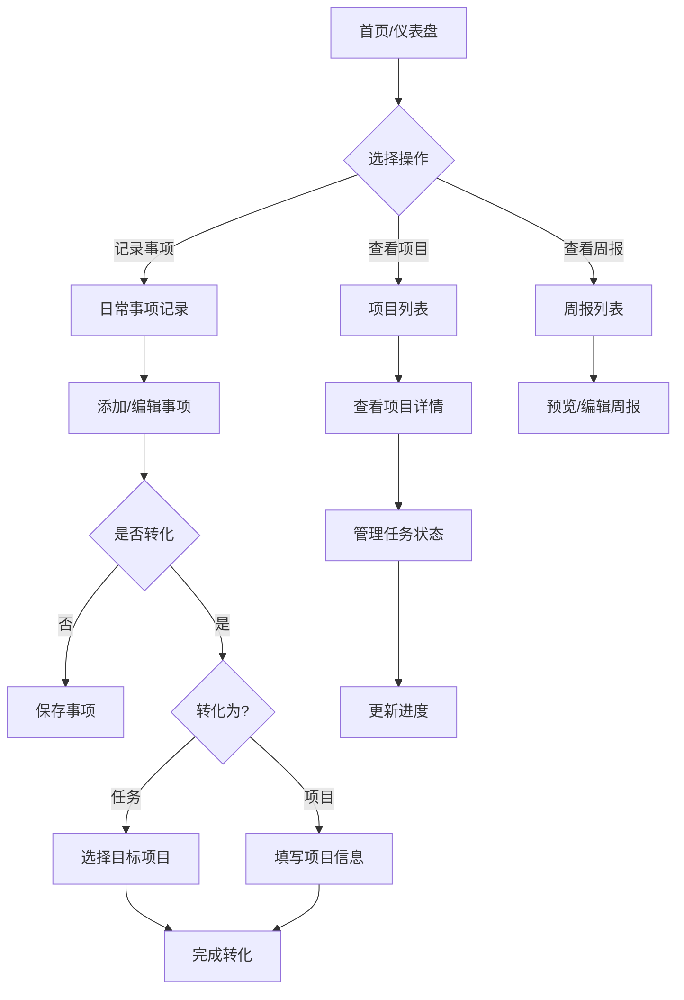
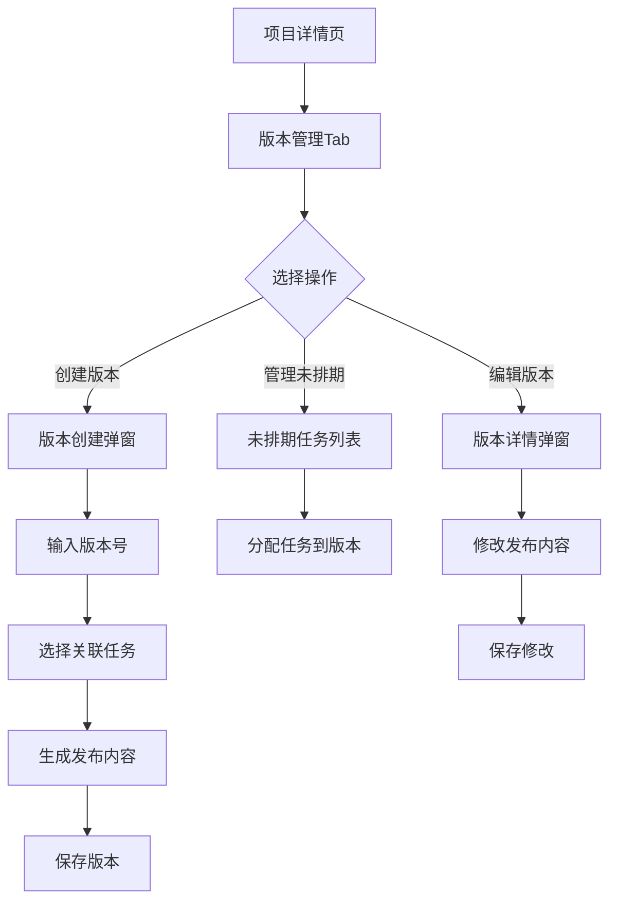
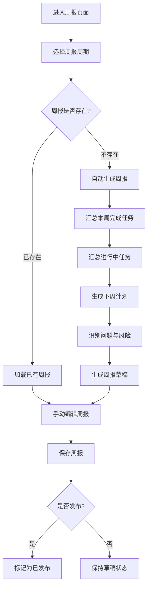

# 日常工作项目管理工具 - 产品需求文档（PRD）

> 文档版本：v1.0
> 创建日期：2026-05-26
> 技术栈：UniApp + SQLite

---

## 一、产品概述

### 1.1 产品定位

轻量级日常工作项目管理工具，帮助个人或小团队高效管理日常事项和项目任务。

### 1.2 核心目标

1. 解决事项记录零散、容易遗漏的问题
2. 实现从日常记录到任务项目的无缝转化
3. 提供清晰的项目进度追踪和节点管理
4. 支持版本发布管理和周报汇总
5. 保持操作简洁，降低使用门槛

### 1.3 用户痛点

- 需求多任务多，项目管理颗粒度不够
- 每天沟通的事项过多，容易遗漏工作
- 缺乏版本发布和周报汇总的便捷工具

---

## 二、技术选型

### 2.1 前端框架

**UniApp** - 基于Vue.js的多端框架

| 优势 | 说明 |
|-----|------|
| 多端支持 | 可编译为小程序、H5、App等多端 |
| Vue生态 | 成熟的Vue技术栈，学习成本低 |
| 开发效率 | 组件丰富，社区活跃 |

### 2.2 数据库

**SQLite** - 轻量级本地数据库

| 优势 | 说明 |
|-----|------|
| 轻量级 | 无需额外部署数据库服务 |
| 数据安全 | 数据本地存储，安全可控 |
| 跨平台 | 支持主流操作系统 |

### 2.3 设计风格

**简洁现代的Material Design风格**

- 界面简洁，操作直观
- 卡片式布局，信息层次清晰
- 配色以蓝色为主色调，灰白色为辅助色

---

## 三、数据模型设计

### 3.1 数据库表结构

#### 3.1.1 daily_items（日常事项表）

| 字段名 | 类型 | 约束 | 说明 |
|-------|------|------|------|
| `id` | INTEGER | PRIMARY KEY AUTOINCREMENT | 主键ID |
| `title` | VARCHAR(200) | NOT NULL | 事项标题 |
| `description` | TEXT | | 事项描述 |
| `category` | VARCHAR(50) | DEFAULT '工作' | 分类标签 |
| `created_at` | DATETIME | DEFAULT CURRENT_TIMESTAMP | 创建时间 |
| `is_converted` | BOOLEAN | DEFAULT FALSE | 是否已转化 |

#### 3.1.2 projects（项目表）

| 字段名 | 类型 | 约束 | 说明 |
|-------|------|------|------|
| `id` | INTEGER | PRIMARY KEY AUTOINCREMENT | 主键ID |
| `name` | VARCHAR(200) | NOT NULL | 项目名称 |
| `description` | TEXT | | 项目描述 |
| `estimated_end_date` | DATE | NOT NULL | 预计完成时间 |
| `development_cycle` | VARCHAR(50) | NOT NULL | 开发周期 |
| `created_at` | DATETIME | DEFAULT CURRENT_TIMESTAMP | 创建时间 |
| `status` | VARCHAR(20) | DEFAULT 'active' | 状态（active/archived） |

#### 3.1.3 tasks（任务表）

| 字段名 | 类型 | 约束 | 说明 |
|-------|------|------|------|
| `id` | INTEGER | PRIMARY KEY AUTOINCREMENT | 主键ID |
| `title` | VARCHAR(200) | NOT NULL | 任务标题 |
| `description` | TEXT | | 任务描述 |
| `project_id` | INTEGER | FOREIGN KEY | 关联项目ID |
| `status` | VARCHAR(20) | DEFAULT 'pending' | 状态（pending/doing/done） |
| `priority` | VARCHAR(20) | DEFAULT 'medium' | 优先级（low/medium/high） |
| `assignee` | VARCHAR(100) | | 负责人 |
| `due_date` | DATE | | 截止日期 |
| `created_at` | DATETIME | DEFAULT CURRENT_TIMESTAMP | 创建时间 |

#### 3.1.4 milestones（项目节点表）

| 字段名 | 类型 | 约束 | 说明 |
|-------|------|------|------|
| `id` | INTEGER | PRIMARY KEY AUTOINCREMENT | 主键ID |
| `project_id` | INTEGER | FOREIGN KEY | 关联项目ID |
| `name` | VARCHAR(200) | NOT NULL | 节点名称 |
| `target_date` | DATE | NOT NULL | 目标日期 |
| `status` | VARCHAR(20) | DEFAULT 'pending' | 状态（pending/achieved/delayed） |
| `created_at` | DATETIME | DEFAULT CURRENT_TIMESTAMP | 创建时间 |

#### 3.1.5 releases（版本表）

| 字段名 | 类型 | 约束 | 说明 |
|-------|------|------|------|
| `id` | INTEGER | PRIMARY KEY AUTOINCREMENT | 主键ID |
| `project_id` | INTEGER | FOREIGN KEY | 关联项目ID |
| `version_name` | VARCHAR(50) | NOT NULL | 版本号（如 v1.0.0） |
| `status` | VARCHAR(20) | DEFAULT 'draft' | 状态（draft/published/retracted） |
| `publisher` | VARCHAR(100) | | 发布负责人 |
| `published_at` | DATETIME | | 发布时间 |
| `created_at` | DATETIME | DEFAULT CURRENT_TIMESTAMP | 创建时间 |

#### 3.1.6 release_contents（版本发布内容表）

| 字段名 | 类型 | 约束 | 说明 |
|-------|------|------|------|
| `id` | INTEGER | PRIMARY KEY AUTOINCREMENT | 主键ID |
| `release_id` | INTEGER | FOREIGN KEY | 关联版本ID |
| `content_type` | VARCHAR(20) | NOT NULL | 内容类型（feature/fix/optimize） |
| `content` | TEXT | NOT NULL | 内容描述 |
| `task_id` | INTEGER | FOREIGN KEY | 关联任务ID |
| `created_at` | DATETIME | DEFAULT CURRENT_TIMESTAMP | 创建时间 |

#### 3.1.7 weekly_reports（周报表）

| 字段名 | 类型 | 约束 | 说明 |
|-------|------|------|------|
| `id` | INTEGER | PRIMARY KEY AUTOINCREMENT | 主键ID |
| `content` | TEXT | NOT NULL | 周报内容（JSON格式） |
| `week_start_date` | DATE | NOT NULL | 周报开始日期（周一） |
| `week_end_date` | DATE | NOT NULL | 周报结束日期（周日） |
| `status` | VARCHAR(20) | DEFAULT 'draft' | 状态（draft/published） |
| `created_at` | DATETIME | DEFAULT CURRENT_TIMESTAMP | 创建时间 |

### 3.2 实体关系图



---

## 四、功能需求

### 4.1 模块一：日常事项记录

| 功能点 | 描述 | 优先级 |
|-------|------|-------|
| 快速记录 | 一键添加日常事项，支持标题、描述、时间 | **Must-have** |
| 分类标签 | 为事项添加分类（工作/生活/学习等） | **Should-have** |
| 搜索过滤 | 按关键词、分类、时间筛选事项 | **Should-have** |
| 提醒设置 | 设置事项提醒时间 | **Could-have** |

### 4.2 模块二：事项转任务/项目

| 功能点 | 描述 | 优先级 |
|-------|------|-------|
| 转化选择 | 日常事项可选择转为「任务」或「项目」 | **Must-have** |
| 任务属性配置 | 设置任务负责人、截止日期、优先级（可跳过，使用默认值） | **Should-have** |
| 项目属性配置 | 设置项目名称、预计完成时间、开发周期（需手动填写） | **Must-have** |
| 关联现有项目 | 将事项转为任务并关联到已有项目 | **Should-have** |

### 4.3 模块三：项目管理

| 功能点 | 描述 | 优先级 |
|-------|------|-------|
| 项目创建 | 创建新项目，设置名称、描述、负责人 | **Must-have** |
| 预计完成时间 | 设置项目预计完成日期 | **Must-have** |
| 开发周期 | 设置项目开发周期（开始日期到预计完成日期） | **Must-have** |
| 预计节点 | 添加/管理项目关键节点及时间点 | **Must-have** |
| 任务列表 | 查看项目下所有任务 | **Must-have** |
| 任务状态管理 | 任务状态流转（待办/进行中/完成） | **Must-have** |
| 项目归档 | 完成项目归档保存 | **Should-have** |

### 4.4 模块四：进度追踪

| 功能点 | 描述 | 优先级 |
|-------|------|-------|
| 进度可视化 | 项目进度百分比展示、进度条 | **Must-have** |
| 节点管理 | 关键节点设置与追踪 | **Must-have** |
| 统计报表 | 任务完成率、项目状态统计 | **Should-have** |

### 4.5 模块五：版本发布管理

| 功能点 | 描述 | 优先级 |
|-------|------|-------|
| 版本创建 | 为项目手动创建版本号（如 v1.0.0） | **Must-have** |
| 版本发布内容生成 | 自动汇总版本内的任务完成情况、功能变更、修复问题 | **Must-have** |
| 版本发布内容编辑 | 手动编辑版本发布内容 | **Must-have** |
| 未排期版本管理 | 展示未排期的项目及任务，支持为任务分配版本 | **Must-have** |
| 版本修改 | 已发布的版本支持重新编辑修改 | **Must-have** |
| 版本历史 | 查看项目所有历史版本记录 | **Should-have** |
| 版本状态 | 追踪版本状态（待发布/已发布/已撤回） | **Should-have** |

### 4.6 模块六：周报管理

| 功能点 | 描述 | 优先级 |
|-------|------|-------|
| 周报自动生成 | 根据当周（自然周）所有项目的任务完成情况，自动汇总生成周报内容 | **Must-have** |
| 周报内容编辑 | 手动编辑周报内容，支持增删改 | **Must-have** |
| 周报预览 | 预览周报格式和内容 | **Should-have** |
| 周报导出 | 支持导出为Markdown或PDF格式 | **Could-have** |
| 周报历史 | 查看历史周报记录 | **Should-have** |
| 按项目筛选 | 周报列表可按项目筛选查看 | **Should-have** |

---

## 五、需求优先级（MoSCoW）

### Must-have（必须有）

- 日常事项快速记录
- 事项转任务/项目（可选择类型）
- 项目创建与管理（含预计完成时间、开发周期）
- 任务状态流转
- 进度可视化
- 项目预计节点管理
- 周报自动生成
- 周报编辑
- 版本创建（手动命名）
- 版本发布内容自动生成
- 版本发布内容编辑
- 未排期版本管理（展示未排期任务）
- 版本修改

### Should-have（应该有）

- 事项分类标签
- 搜索过滤功能
- 统计报表
- 项目归档
- 周报预览
- 周报历史
- 版本历史
- 版本状态追踪

### Could-have（可以有）

- 提醒设置
- 数据导出
- 周报导出（Markdown/PDF）

---

## 六、非功能需求

| 类别 | 要求 |
|-----|------|
| **操作简洁性** | 核心操作步骤不超过3步，避免繁琐录入 |
| **性能** | 页面加载时间 < 2s，操作响应即时 |
| **可用性** | 操作简洁，学习成本低，新手可快速上手 |
| **安全性** | 数据本地存储，支持数据导出备份 |
| **兼容性** | 支持主流浏览器（Chrome、Edge、Safari） |

---

## 七、页面结构

| 页面名称 | 路径 | 功能定位 |
|---------|------|---------|
| **首页仪表盘** | `/` | 概览今日事项、进行中任务、项目进度 |
| **日常事项页** | `/daily-items` | 事项列表、添加/编辑/转化事项 |
| **项目列表页** | `/projects` | 项目卡片展示、进度概览 |
| **项目详情页** | `/projects/:id` | 项目任务管理、节点追踪、版本管理 |
| **周报列表页** | `/reports` | 周报历史记录、预览 |

---

## 八、用户流程

### 8.1 主流程



### 8.2 版本发布流程



### 8.3 周报生成流程



---

## 九、周报内容结构

### 周报按自然周（周一至周日）自动汇总

| 板块 | 内容来源 | 说明 |
|-----|---------|------|
| **本周完成** | 本周内状态变更为「已完成」的所有任务 | 按项目分组展示 |
| **进行中任务** | 当前状态为「进行中」的任务及进度 | 按项目分组展示 |
| **下周计划** | 截止日期在下周的任务，以及即将到期的节点 | 按项目分组展示 |
| **问题与风险** | 延期的任务、延期的节点 | 自动识别并提示 |

### 周报content字段JSON结构

```json
{
  "week_info": {
    "week_number": 21,
    "year": 2026,
    "start_date": "2026-05-19",
    "end_date": "2026-05-25"
  },
  "completed_tasks": [
    {
      "project_name": "电商后台管理系统",
      "tasks": [
        {"id": 1, "title": "需求文档编写", "completed_at": "2026-05-20"},
        {"id": 2, "title": "UI设计稿确认", "completed_at": "2026-05-22"}
      ]
    }
  ],
  "in_progress_tasks": [
    {
      "project_name": "电商后台管理系统",
      "tasks": [
        {"id": 3, "title": "接口开发", "progress": "60%"},
        {"id": 4, "title": "数据库设计", "progress": "30%"}
      ]
    }
  ],
  "next_week_plan": [
    {
      "project_name": "电商后台管理系统",
      "tasks": [
        {"id": 5, "title": "前端开发", "due_date": "2026-05-28"}
      ]
    }
  ],
  "issues_and_risks": [
    {
      "type": "delayed_task",
      "project_name": "电商后台管理系统",
      "description": "任务「数据库设计」已延期3天"
    }
  ]
}
```

---

## 十、版本发布内容要素

| 要素 | 说明 |
|-----|------|
| 版本号 | 手动输入，如 v1.0.0 |
| 发布时间 | 自动记录或手动设置 |
| 负责人 | 版本发布负责人 |
| 变更内容 | 包含新增功能、修复问题、优化项等 |
| 关联任务 | 本版本包含的任务列表 |

---

## 十一、原型线框图

### 11.1 首页仪表盘

```
┌─────────────────────────────────────────────────────────────┐
│  [Logo] 项目管理工具                    [搜索] [设置]       │
├─────────────────────────────────────────────────────────────┤
│  ┌─────────────┐  ┌─────────────┐  ┌─────────────┐         │
│  │ 今日事项    │  │ 进行中任务  │  │ 项目进度    │         │
│  │ 3 项待处理  │  │ 5 个进行中  │  │ 65% 完成    │         │
│  └─────────────┘  └─────────────┘  └─────────────┘         │
├─────────────────────────────────────────────────────────────┤
│  [日常事项]    [项目列表]    [周报]    [添加事项]           │
├─────────────────────────────────────────────────────────────┤
│  ┌─────────────────────────────────────────────────────┐   │
│  │ 快捷入口                                            │   │
│  │  ┌──────┐  ┌──────┐  ┌──────┐  ┌──────┐            │   │
│  │  │记录  │  │项目  │  │任务  │  │周报  │            │   │
│  │  │事项  │  │管理  │  │管理  │  │生成  │            │   │
│  │  └──────┘  └──────┘  └──────┘  └──────┘            │   │
│  └─────────────────────────────────────────────────────┘   │
├─────────────────────────────────────────────────────────────┤
│  ┌─────────────────────────────────────────────────────┐   │
│  │ 最近动态                                            │   │
│  │ • 任务「需求文档编写」已完成                          │   │
│  │ • 项目「电商后台」新增节点「设计评审」                  │   │
│  │ • 本周周报已生成                                    │   │
│  └─────────────────────────────────────────────────────┘   │
└─────────────────────────────────────────────────────────────┘
```

### 11.2 日常事项页

```
┌─────────────────────────────────────────────────────────────┐
│  [返回] 日常事项                        [添加事项]         │
├─────────────────────────────────────────────────────────────┤
│  ┌─────────────┐  ┌─────────────┐                         │
│  │ 全部 (12)   │  │ 未转化 (8)  │                         │
│  └─────────────┘  └─────────────┘                         │
├─────────────────────────────────────────────────────────────┤
│  ┌─────────────────────────────────────────────────────┐   │
│  │ 事项列表                                            │   │
│  │ ┌────────────────────────────────────────────────┐  │   │
│  │ │ [复选框] 完成需求分析文档            [工作]      │  │   │
│  │ │ 描述：整理项目需求，编写需求文档         [转化]   │  │   │
│  │ └────────────────────────────────────────────────┘  │   │
│  │ ┌────────────────────────────────────────────────┐  │   │
│  │ │ [复选框] 参加产品评审会议            [工作]      │  │   │
│  │ │ 描述：下午3点会议室B                  [转化]   │  │   │
│  │ └────────────────────────────────────────────────┘  │   │
│  └─────────────────────────────────────────────────────┘   │
└─────────────────────────────────────────────────────────────┘
```

### 11.3 项目列表页

```
┌─────────────────────────────────────────────────────────────┐
│  [返回] 项目列表                        [新建项目]         │
├─────────────────────────────────────────────────────────────┤
│  ┌─────────────────────────────────────────────────────┐   │
│  │ 项目卡片网格                                          │   │
│  │ ┌─────────────────────────────┐                       │   │
│  │ │ 电商后台管理系统            │                       │   │
│  │ │ 预计完成：2026-08-31       │                       │   │
│  │ │ 开发周期：3个月             │                       │   │
│  │ │ ████████████░░░░ 65%       │                       │   │
│  │ │ [查看详情] [生成周报]       │                       │   │
│  │ └─────────────────────────────┘                       │   │
│  │ ┌─────────────────────────────┐                       │   │
│  │ │ 移动端APP开发              │                       │   │
│  │ │ 预计完成：2026-10-15       │                       │   │
│  │ │ 开发周期：4个月             │                       │   │
│  │ │ █████░░░░░░░░░░ 30%        │                       │   │
│  │ │ [查看详情] [生成周报]       │                       │   │
│  │ └─────────────────────────────┘                       │   │
│  └─────────────────────────────────────────────────────┘   │
└─────────────────────────────────────────────────────────────┘
```

### 11.4 项目详情页

```
┌─────────────────────────────────────────────────────────────┐
│  [返回] 电商后台管理系统                    [编辑项目]      │
├─────────────────────────────────────────────────────────────┤
│  ┌─────────────────────────────────────────────────────┐   │
│  │ 项目信息                                            │   │
│  │ 名称：电商后台管理系统                              │   │
│  │ 描述：电商平台后台管理系统开发                      │   │
│  │ 预计完成：2026-08-31    开发周期：3个月            │   │
│  └─────────────────────────────────────────────────────┘   │
├─────────────────────────────────────────────────────────────┤
│  [任务列表]    [项目节点]    [周报管理]    [版本管理]       │
├─────────────────────────────────────────────────────────────┤
│  ┌─────────────────────────────────────────────────────┐   │
│  │ 任务列表                                            │   │
│  │ ┌────────────────────────────────────────────────┐  │   │
│  │ │ ☐ 需求文档编写              进行中    高优先级 │  │   │
│  │ │ ☐ UI设计稿确认              待办      中优先级 │  │   │
│  │ │ ☑ 技术方案评审              已完成    高优先级 │  │   │
│  │ └────────────────────────────────────────────────┘  │   │
│  └─────────────────────────────────────────────────────┘   │
└─────────────────────────────────────────────────────────────┘
```

### 11.5 事项转化弹窗

```
┌──────────────────────────────────────────┐
│            转化事项                      │
├──────────────────────────────────────────┤
│  请选择转化类型：                        │
│                                         │
│  ⬤ 转化为任务                           │
│     └─ 关联项目：[下拉选择项目]          │
│                                         │
│  ○ 转化为项目                           │
│     └─ 项目名称：[输入框]                │
│        预计完成时间：[日期选择器]        │
│        开发周期：[输入框]                │
│                                         │
│  ┌─────────┐     ┌─────────┐            │
│  │ 取消    │     │ 确定    │            │
│  └─────────┘     └─────────┘            │
└──────────────────────────────────────────┘
```

### 11.6 版本管理Tab

```
┌─────────────────────────────────────────────────────────────┐
│  [任务列表]    [项目节点]    [周报管理]    [版本管理]       │
├─────────────────────────────────────────────────────────────┤
│  项目：电商后台管理系统                                     │
├─────────────────────────────────────────────────────────────┤
│  ┌─────────────────────────────────────────────────────┐   │
│  │ 未排期任务                                            │   │
│  │ （未分配到任何版本的任务）                            │   │
│  │ ┌────────────────────────────────────────────────┐  │   │
│  │ │ ☐ 任务A - 需求文档编写              [分配版本▼] │  │   │
│  │ │ ☐ 任务B - UI设计稿确认            [分配版本▼] │  │   │
│  │ └────────────────────────────────────────────────┘  │   │
│  └─────────────────────────────────────────────────────┘   │
├─────────────────────────────────────────────────────────────┤
│  ┌─────────────────────────────────────────────────────┐   │
│  │ 已排期版本                          [创建版本]       │   │
│  │ ┌────────────────────────────────────────────────┐  │   │
│  │ │ v1.0.0                          [已发布]        │  │   │
│  │ │ 发布时间：2026-05-26                          │  │   │
│  │ │ 负责人：张三                                    │  │   │
│  │ │ 关联任务：3个                                  │  │   │
│  │ │ [查看详情] [编辑] [撤回]                       │  │   │
│  │ └────────────────────────────────────────────────┘  │   │
│  │ ┌────────────────────────────────────────────────┐  │   │
│  │ │ v0.9.0                          [草稿]          │  │   │
│  │ │ 关联任务：2个                                  │  │   │
│  │ │ [查看详情] [编辑] [发布]                       │  │   │
│  │ └────────────────────────────────────────────────┘  │   │
│  └─────────────────────────────────────────────────────┘   │
└─────────────────────────────────────────────────────────────┘
```

### 11.7 创建版本弹窗

```
┌──────────────────────────────────────────┐
│            创建版本                      │
├──────────────────────────────────────────┤
│  项目：电商后台管理系统（自动填充）       │
│                                          │
│  版本号：                                │
│  [v1.0.0                                ] │
│                                          │
│  选择关联任务：                          │
│  （仅显示当前项目下未排期的任务）          │
│  ┌──────────────────────────────────┐   │
│  │ ☐ 任务A - 需求文档编写          │   │
│  │ ☑ 任务B - UI设计稿确认          │   │
│  │ ☑ 任务C - 接口开发              │   │
│  └──────────────────────────────────┘   │
│                                          │
│  发布内容预览：                          │
│  ┌──────────────────────────────────┐   │
│  │ 【新增功能】                      │   │
│  │ • UI设计稿确认                    │   │
│  │ • 接口开发                        │   │
│  │ 【修复问题】                      │   │
│  │ 无                                │   │
│  │ 【优化项】                        │   │
│  │ 无                                │   │
│  └──────────────────────────────────┘   │
│                                          │
│  ┌─────────┐     ┌─────────┐           │
│  │ 取消    │     │ 保存草稿 │ [发布]   │
│  └─────────┘     └─────────┘           │
└──────────────────────────────────────────┘
```

### 11.8 周报列表页

```
┌─────────────────────────────────────────────────────────────┐
│  [返回] 周报管理                        [生成周报]        │
├─────────────────────────────────────────────────────────────┤
│  筛选：[全部项目 ▼]    状态：[全部 ▼]                       │
├─────────────────────────────────────────────────────────────┤
│  ┌─────────────────────────────────────────────────────┐   │
│  │ 第21周（2026-05-19 ~ 2026-05-25）    [已发布]       │   │
│  │ 生成时间：2026-05-26 10:30                            │   │
│  │ ┌───────────────────────────────────────────────┐ │   │
│  │ │ 本周完成：5个任务                              │ │   │
│  │ │ 进行中：8个任务                                │ │   │
│  │ │ 下周计划：3个任务                              │ │   │
│  │ │ 问题与风险：1项                                │ │   │
│  │ └───────────────────────────────────────────────┘ │   │
│  │ [预览] [编辑] [导出]                               │   │
│  └─────────────────────────────────────────────────────┘   │
│  ┌─────────────────────────────────────────────────────┐   │
│  │ 第20周（2026-05-12 ~ 2026-05-18）    [草稿]         │   │
│  │ [预览] [编辑] [导出]                               │   │
│  └─────────────────────────────────────────────────────┘   │
└─────────────────────────────────────────────────────────────┘
```

### 11.9 周报预览弹窗

```
┌─────────────────────────────────────────────────────────────┐
│                    周报预览                                 │
├─────────────────────────────────────────────────────────────┤
│  第21周工作周报（2026-05-19 ~ 2026-05-25）                  │
├─────────────────────────────────────────────────────────────┤
│  一、本周完成                                              │
│  【电商后台管理系统】                                      │
│  • 需求文档编写 - 2026-05-20                              │
│  • UI设计稿确认 - 2026-05-22                              │
│                                                             │
│  二、进行中任务                                            │
│  【电商后台管理系统】                                      │
│  • 接口开发 - 进度60%                                     │
│  • 数据库设计 - 进度30%                                   │
│                                                             │
│  三、下周计划                                              │
│  【电商后台管理系统】                                      │
│  • 前端开发 - 预计完成日期：2026-05-28                    │
│                                                             │
│  四、问题与风险                                            │
│  ⚠️ 任务「数据库设计」已延期3天                            │
├─────────────────────────────────────────────────────────────┤
│                              [关闭]                        │
└─────────────────────────────────────────────────────────────┘
```

---

## 十二、版本历史

| 版本 | 日期 | 说明 |
|-----|------|------|
| v1.0 | 2026-05-26 | 初始版本，包含需求规划全部内容 |

---

## 附录

### A. 操作简洁性设计原则

1. **事项转化流程优化**
   - 流程：选择事项 → 点击转化 → 选择「任务」或「项目」→ 填写必要信息 → 完成
   - 任务转化：选择目标项目（可选）→ 完成
   - 项目转化：填写项目名称、预计完成时间、开发周期 → 完成

2. **默认值策略**
   - 任务优先级：默认「中」
   - 任务负责人：默认当前用户
   - 项目截止日期：无默认值，需手动填写
   - 项目开发周期：无默认值，需手动填写

3. **快捷操作入口**
   - 悬浮按钮：首页添加"+"按钮，一键快速记录事项
   - 右键菜单：列表项右键直接显示"转任务"、"转项目"选项
   - 批量操作：支持多选事项批量转化

### B. 数据关系总结

```
项目（projects）
    ├── 任务（tasks）- 一个项目包含多个任务
    │       └── 可关联到版本（release_contents）
    ├── 节点（milestones）- 一个项目包含多个节点
    ├── 版本（releases）- 一个项目包含多个版本
    │       └── 版本内容（release_contents）
    └── 周报（weekly_reports）- 全局维度，按自然周生成
```

---

**文档结束**
